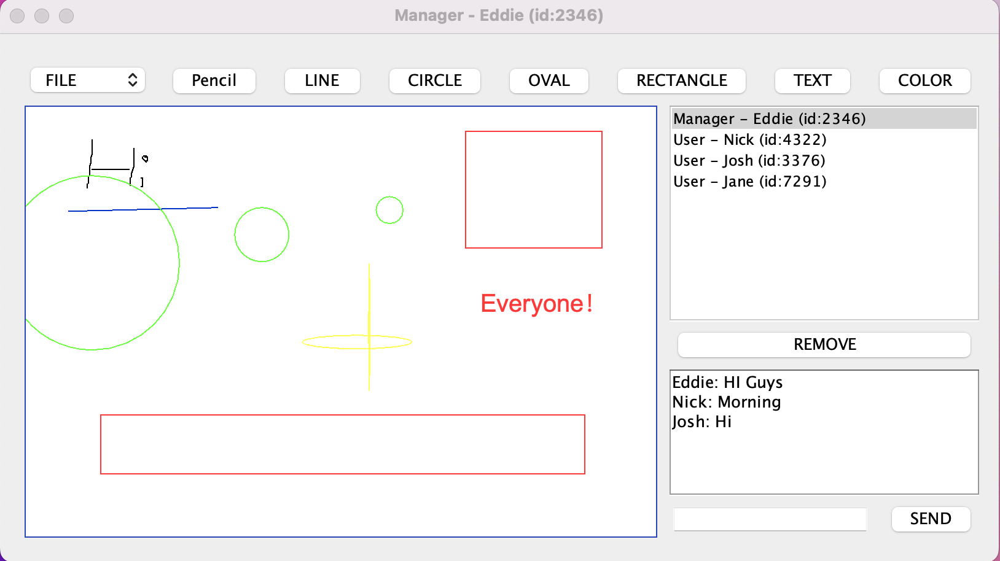

# Distributed Shared WhiteBoard
## Overview
This project aims to create a distributed shared whiteboard that enables multiple users to collaborate in real-time. Users can draw on a shared canvas, supporting features like freehand drawing, shapes, text input, and color selection. The system is implemented in Java, and choose technologies like TCP/IP Sockets for building this distributed application.

## Main Challenges
- Concurrency Handling: Addressing simultaneous actions to maintain a reasonable state.
- System Structuring: Options include multiple servers communicating or a central server managing the system state.
- Networked Communication: Deciding when and what messages are sent across the network, and designing an exchange protocol.
- GUI Implementation: Utilizing tools like Java Swing drawing package for functionality resembling MS Paint.

## Key Features



1. **Multiuser Whiteboard:**
   - Support multiple users drawing on a shared canvas.
   - Single shared whiteboard for all clients.
2. **Key Elements with GUI:**
   - Support drawing shapes (line, circle, oval, rectangle).
   - Text input allowing users to type anywhere on the whiteboard.
   - Choose from at least 16 colors for drawing.
3. **Chat Window:**
   - Text-based communication among users.
4. **File Menu:**
   - New, open, save, saveAs, and close functionalities managed by the manager.
5. **Manager Controls:**
   - Allow the manager to kick out a specific user.
   - Allow the manager to approve a user to join.

## Running Commonds

1. Create Whiteboard:

   ```java
   java CreateWhiteBoard <serverIPAddress> <serverPort>
   ```

2. Join Whiteboard:

   ```
   java JoinWhiteBoard <serverIPAddress> <serverPort>
   ```


